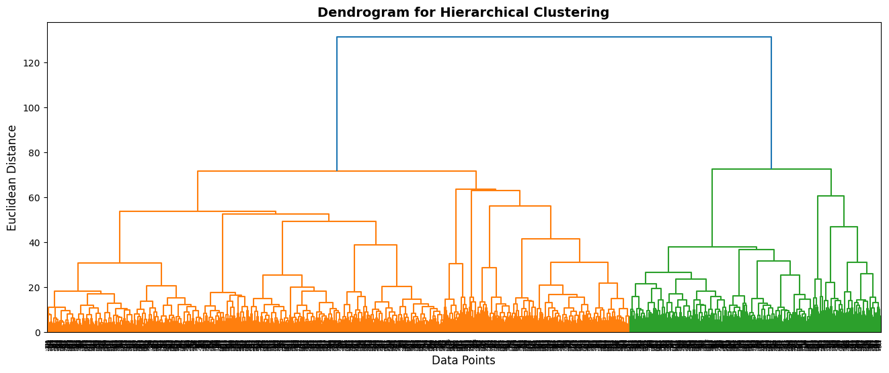
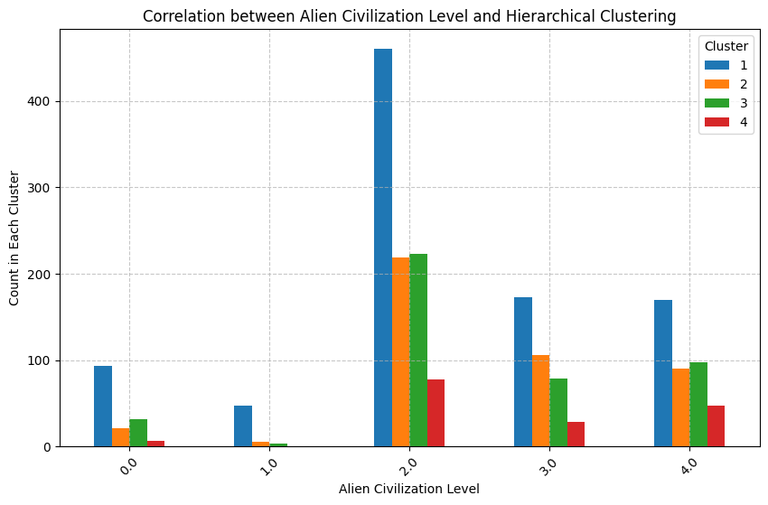

# **AIML 2024-2025 Project**
---
---

### **Team Members**
- **Vince Coppens**
- **Mateusz Waglowski**
- **Hamza Yazan Jamal**

---
---

## **Introduction**

This project explores a dataset titled `alien_galaxy.csv` to analyze patterns, preprocess data, and apply clustering techniques for insight extraction. The primary goal is to define the different types of alien species and their characteristics using various clustering methods. Before clustering, the dataset undergoes thorough exploration, imputation, and cleaning to ensure accurate analysis. By leveraging advanced data imputation, dimensionality reduction, and visualization tools, this project demonstrates the application of machine learning techniques to solve complex analytical tasks and derive actionable insights.

---
---

## **Methods & Experimental design**
---

### **Libraries**
Installing and importing all necessary Python libraries.

---

### **Import and Prepare Dataset**

The dataset alien_galaxy.csv was imported and the variables were reviewed to understand their representations and identify whether they were numerical or categorical. No duplicate rows were identified during this process.

The missingno library was used to visualize missing values in the dataset. This analysis revealed that only 0.03% of the rows were complete, and each column was missing approximately 10% of its data. Since dropping rows would result in significant data loss, it was decided that the missing values would need to be imputed.

The Discovery_Date variable, originally a string, was converted to a timestamp format and standardized for consistency. Correlation values between variables were calculated and, although they were generally low, these correlations were stored in a dataframe for future use. Additionally, a custom function was created to easily plot the distributions of variables, enabling a more straightforward examination of their characteristics.

---

### **Imputing data**
First, the categorical variables in the dataset were transformed. Missing values in these variables were imputed using the most_frequent strategy to ensure consistency. After imputation, one-hot encoding was applied to convert categorical variables into a numerical format suitable for analysis. For categorical variables with an inherent order, level coding was used to preserve their ordinal nature.
#### **Imputing dataset using the distributions**
The distributions of the variables were plotted to better understand their characteristics. Binomial and multinomial distributions were easy to recognize visually, while the other distributions were more challenging to identify. For these, a custom function was used to determine the most likely distributions based on likelihood estimation.

Once the distributions were identified, missing values were imputed using the corresponding distributions to maintain consistency with the data’s natural variability. After imputation, the correlations between variables were reassessed, revealing a significant drop in their values.

#### **Imputing dataset using KNN imputer**
As the initial imputation approach led to a significant loss of information (lower correlations), KNN imputation was explored as an alternative to better preserve relationships between variables. After imputing the missing values, a pairplot was generated to visualize variable interactions and identify any remaining issues.

While correlations are less critical for clustering, highly correlated variables can unnecessarily complicate the model.

Outliers were removed to improve data quality and ensure a more balanced dataset. A range_multiplier of 3 was chosen instead of the standard 1.5, as the latter would have eliminated an excessive number of values. Using this approach, approximately 11% of the dataset was removed. Binary variables with an overwhelming majority of 0 values were excluded from the interquartile range (IQR) filtering, as their IQR was 0. Including these variables would have caused a substantial loss of data, so they were specifically handled to preserve the dataset’s integrity.

Additionally, binary variables with minimal variability (near-constant behavior) were identified and removed to simplify the dataset further.

This time, correlations were better preserved, providing a more consistent and reliable foundation for subsequent analysis.

---
### **Clustering**
............................................
#### **Hierarchical clustering**
To explore clustering in the dataset, linkage matrices were generated using different linkage methods (single, complete, average, and ward). The elbow method, particularly for the ward linkage, suggested setting the number of clusters to 3. Based on this, clusters were generated, and dendrograms were plotted to visualize the hierarchical structure.

An attempt was made to find a link between the alien_civilization_level variable and the clusters. However, no clear relationship was observed. Plotting the relative counts for this variable might provide better insights in the future.

Dimensionality reduction was performed using PCA to visualize the clusters. In the 2D visualization, clusters were distinguishable, with Exploration_Missions and Young_Colonies emerging as the most significant variables contributing to the clusters. For further clarity, a 3D visualization was also created, where clusters were even more clearly defined. The key variables in the 3D space were Exploration_Missions, Young_Colonies, and Military_Engagements.

To evaluate cluster quality, hyperparameter tuning was conducted using the Calinski-Harabasz Index. This metric, also known as the Variance Ratio Criterion, measures the quality of clustering by comparing between-cluster dispersion (how distinct clusters are from one another) to within-cluster dispersion (how compact clusters are). A higher Calinski-Harabasz Index indicates better-defined clusters with clear separation and tight groupings. AgglomerativeClustering models were tested with various linkage methods (ward, complete, average, single), distance metrics (euclidean, manhattan, cosine), and different numbers of clusters to identify the best-performing configuration. The results, including the typical characteristics of the clusters as they currently appear, will be described in detail in the results section.

............................................
#### **K-Means clustering**

---

### **Flowchart**

---
---

## **Results**

Please refer to the notebook for a detailed overview of the defining cluster variables and their corresponding values, as we aimed to keep this report concise.

---

#### **Results**
3 clusters, euclidian distance, ward linkage
- **Cluster 1** includes advanced civilizations with high population, energy consumption, and resource production.
- **Cluster 2** represents smaller civilizations with minimal resources and production, suggesting limited development.
- **Cluster 3** strikes a balance, representing civilizations with intermediate levels of resources and activity.

#### **Hyperparameter tuning**
2 clusters, cosine distance, complete linkage
- **Cluster 1** comprises highly developed civilizations with strong economies, larger populations, and significant resource utilization.
- **Cluster 2** includes developing civilizations with smaller populations, minimal resource production, and lower energy needs.

---
---

## **Conclusions**

---